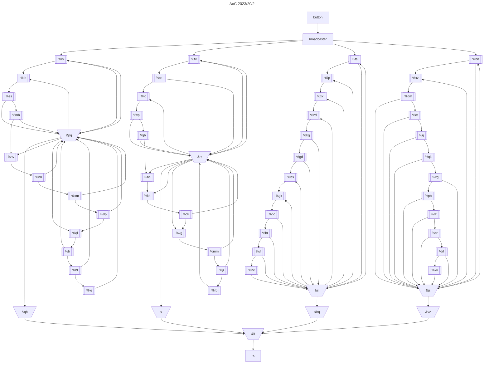

```mermaid
---
title: AoC 2023/20/2
---
flowchart TD
   button[button]
   dm[[%dm]]
   ft[\&ft/]
   hc[[%hc]]
   kg[[%kg]]
   sl[\&sl/]
   rf[[%rf]]
   zd[[%zd]]
   dp[[%dp]]
   ss[[%ss]]
   rr[\&rr/]
   hv[[%hv]]
   nh[[%nh]]
   jz[\&jz/]
   vf[[%vf]]
   gk[[%gk]]
   bs[[%bs]]
   pq[\&pq/]
   jb[[%jb]]
   fv[[%fv]]
   vz[\&vz/]
   mm[[%mm]]
   vg[[%vg]]
   cd[[%cd]]
   bq[\&bq/]
   xg[[%xg]]
   xx[[%xx]]
   ls[[%ls]]
   pb[[%pb]]
   tc[[%tc]]
   kh[[%kh]]
   lp[[%lp]]
   tb[[%tb]]
   qk[[%qk]]
   xz[[%xz]]
   jr[[%jr]]
   mb[[%mb]]
   qh[\&qh/]
   lt[\&lt/]
   rb[[%rb]]
   pc[[%pc]]
   hr[[%hr]]
   gd[[%gd]]
   xm[[%xm]]
   ct[[%ct]]
   ck[[%ck]]
   cr[[%cr]]
   bn[[%bn]]
   vp[[%vp]]
   hl[[%hl]]
   ts[[%ts]]
   rz[[%rz]]
   ql[[%ql]]
   xk[[%xk]]
   vj[[%vj]]
   tr[[%tr]]
   broadcaster[broadcaster]
   nc[[%nc]]
   rj[[%rj]]
   rx[rx]
   button --> broadcaster
   dm --> jz
   dm --> ct
   ft --> rx
   hc --> kh
   kg --> gd
   kg --> sl
   sl --> bs
   sl --> bq
   sl --> ts
   sl --> zd
   sl --> gk
   sl --> xx
   sl --> lp
   rf --> xk
   rf --> jz
   zd --> kg
   dp --> ql
   dp --> pq
   ss --> pq
   ss --> mb
   rr --> hc
   rr --> lt
   rr --> kh
   rr --> fv
   rr --> tc
   rr --> vg
   hv --> nh
   nh --> pq
   nh --> xm
   jz --> bn
   jz --> vz
   jz --> xz
   vf --> nc
   vf --> sl
   gk --> pc
   bs --> gk
   pq --> tb
   pq --> qh
   pq --> ls
   pq --> hv
   pq --> ql
   jb --> rr
   jb --> hc
   fv --> cd
   fv --> rr
   vz --> ft
   mm --> jr
   mm --> rr
   vg --> mm
   cd --> tc
   cd --> rr
   bq --> ft
   xg --> pb
   xg --> jz
   xx --> zd
   ls --> tb
   ls --> pq
   pb --> jz
   pb --> rz
   tc --> vp
   kh --> ck
   lp --> xx
   tb --> ss
   qk --> jz
   qk --> xg
   xz --> dm
   jr --> rb
   jr --> rr
   mb --> hv
   mb --> pq
   qh --> ft
   lt --> ft
   rb --> rr
   pc --> hr
   pc --> sl
   hr --> vf
   hr --> sl
   gd --> bs
   gd --> sl
   xm --> dp
   xm --> pq
   ct --> jz
   ct --> rj
   ck --> vg
   ck --> rr
   cr --> jz
   cr --> rf
   bn --> xz
   bn --> jz
   vp --> rr
   vp --> jb
   hl --> pq
   hl --> vj
   ts --> lp
   ts --> sl
   rz --> jz
   rz --> cr
   ql --> tr
   xk --> jz
   vj --> pq
   tr --> pq
   tr --> hl
   broadcaster --> ls
   broadcaster --> fv
   broadcaster --> ts
   broadcaster --> bn
   nc --> sl
   rj --> jz
   rj --> qk
```
